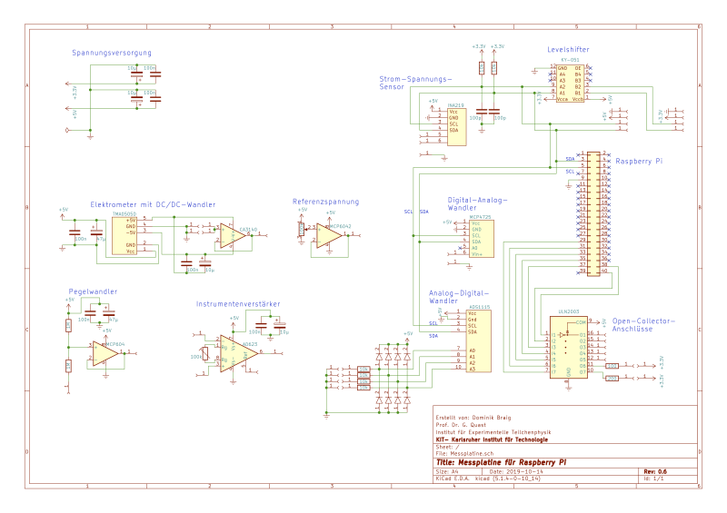
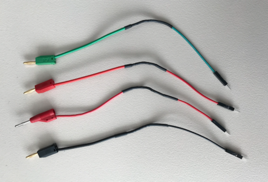
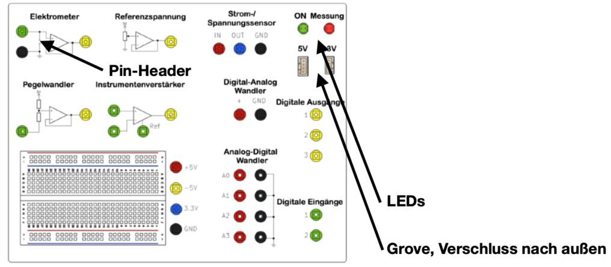
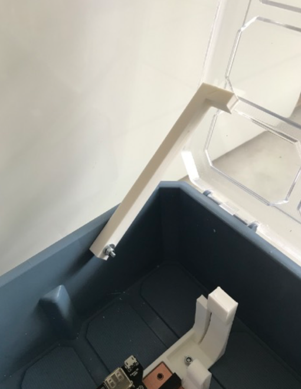
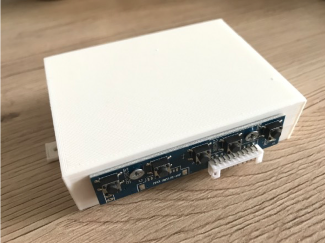
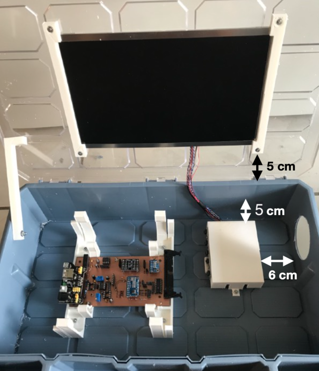
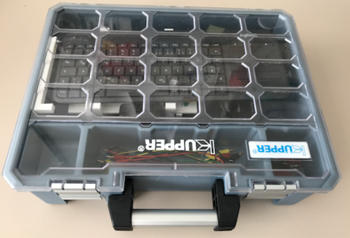

# PhyPiDAQ Building instructions for Measurement Case

---  

This is the English version for educators of the project PhyPiDAQ,
a package for acquisition, storage, visualization and analysis of measurement data
with the [Raspberry Pi](https://www.raspberrypi.com/).

Hier gibt es die [Deutsche Version](Dokumentation_de.md).  

---  

In this manual, we give building instruction including the list
of recommended parts for a measurement case supporting the measurements
described in the EducatorsGuide.

- [What is PhyPiDAQ?](#wasistphypidaq)
- [What do I need and how do I assemble it?](#wasbraucheichundwiebaueichdaszusammen)
  - [order list](#bestellliste)
  - [building instructions](#bauanleitung)
    - [soldering the circuit board](#platineloeten)
    - [building the suitcase](#kofferbauen)

## 1. What is PhyPiDAQ?
PhyPiDAQ is a project for transparent, easily understandable Data AQuisition (DAQ) 
with a Raspberry Pi. The software contains basic functions for data acquisition and
visualization such as data logger, bar graph, XY or oscilloscope display and data 
recording on disk for subsequent evaluation.

The user interface is designed in such a way that pre-made templates for many 
sensors can be used to read them out quickly and easily.  In addition, it also offers 
the option of changing parameters like, e. g.  sampling rate, range,  axis labeling, 
function evaluation for direct conversion of raw measurements of special sensor
settings. The settings can be conveniently saved and recalled so that initial examples
for own experiments or for a quick demonstration can be easily provided. 

A large number of sensors, such as various analog-digital converters,  current sensors, 
environmental data sensors, gamma ray detectors or a usb-oscilloscope, are supported.
Here, widespread and inexpensive sensors were used, which have a sufficient level 
of accuracy that is more than sufficient for school experiments. A typical example
of a measruement ist shown in Fig. 1.

*Fig. 1*:  Representation of the time dependence of two signal sources  
  (square wave and capacitor voltage) connected to an AD converter  
                      

The sensors can be individually connected to the Raspberry Pi using jumper cables, 
or via a printed board specially designed for use with the PhyPiDAQ software on which
some sensors and amplifiers are permanently attached. The latter set-up reduces
cabling efforts to a minimum and experiments can be set up quickly.  A 3d printed
connection panel and a printed circuit-board  are available so that all components
can be conveniently  provided  in an organizer case.  

This manual describes a proposal for a measurement case that can be used generally for 
data acquisition, containing various components for the measurement of voltages and 
currents as well as an electrometer amplifier circuit for high-resistance measurements of 
electric charges or smallest currents and an instrumentation amplifier for the registration 
of voltages in the µV range. Convenient for adaptation to the voltage range of 0-5\&nbsp;V 
of typical analogue-to-digital converters is a level converter. A digital-to-analogue 
converter and a reference voltage adjustable by means of a potentiometer are also provided.
A prototype version of the case is shown in Fig. 2a, and the circuit diagram in Fig. 2b.

*Fig. 2a*:  Measurement case with Raspberry Pi, circuit board and built-in display  
                      

*Fig. 2b*:  Circuit Diagram  
                      

The assembly instructions for the measuring case can be found in the following chapters. 
Concrete applications and more detailed descriptions of the necessary amplifier circuits 
can be found in the 
[Educators Guide](https://github.com/PhyPiDAQ/EducatorsGuide/blob/main/EducatorsGuide.md)

  

## 2. What do I need and how do I assemble it?  
The software is open source and can be downloaded from this Github page. 
The  detailed installation is described [here](#wiesetzeichendenraspberrypiauf).  

The following components are required for the measurement box:  

### 2.1 Order list

| Description | Order number | Quantity | Supplier | Unit price in euros | Total price in euros |
| ------------- |:-------------:|:-:|:--------:|-|-|
| **for the plug-in board:** | | | | | |
| Miniature socket, 2mm black | MBI 1 SW | 9 | Reichelt | 0.79 | 7.11 |
| Miniature socket, 2mm red | MBI 1 RT | 8 | Reichelt | 0.79 | 6.32 |
| Miniature socket, 2mm green | MBI 1 GN | 8 | Reichelt | 0.79 | 6.32 |
| Miniature socket, 2mm yellow | MBI 1 GE | 9 | Reichelt | 0.79 | 7.11 |
| Miniature socket, 2mm blue | MBI 1 BL | 3 | Reichelt | 0.79 | 2.37 |
| Arduino - Grove universal socket, 4-pin (set of 10) | GRV CONNEC4PIN | 1 | Reichelt | 1.25 | 1.25 |
| Standard LED green 5 mm | RND 135-00122 | 1 | Reichelt | 0.06 | 0.06 |
| Standard LED red 5 mm | RND 135-00126 | 1 | Reichelt | 0.06 | 0.06 |
| Breadboard 400 holes | RND 255-00005 | 1 | Reichelt | 1.90 | 1.90 |
| Socket strip 2.54 mm, 1x20 | MPE 115-1-020 | 4 | Reichelt | 1.20 | 4.80 |
| Filament for 3D printer | | 120g | | | |
| | | | | | |
| **for the board:** | | | | | |
| PCB board "PhyPiDAQ" | https://aisler.net/p/ABFAPVWM | 1 | Aisler | approx. 10 euros | approx. 10 euros |
| Operational amplifier, 1-way, DIP-8 | CA 3140 DIP | 1 | Reichelt | 0.99 | 0.99 |
| Instrumentation amplifier, 1-way, DIP-8 | AD 623 ANZ | 1 | Reichelt | 6.35 | 6.35 |
| Seven Darlington Arrays, DIP-16 | ULN 2003A | 1 | Reichelt | 0.30 | 0.30 |
| Operational amplifier, 2-way, DIP-8 | MCP 6042-I / P | 2 | Reichelt | 0.66 | 1.32 |
| DC-DC 5V converter | TMA 0505D | 1 | Reichelt | 5.50 | 5.50 |
| Analog / digital converter ADS1115 | RPI ADC 4CH | 1 | Reichelt | 3.30 | 3.30 |
| Rectifier diode | UF 4003 | 8 | Reichelt | 0.05 | 0.40 |
| Level shifter | DEBO LEV SHIFTER | 1 | Reichelt | 4.15 | 4.15 |
| INA219 current / voltage sensor | DEBO SENS POWER | 1 | Reichelt | 2.80 | 2.80 |
| Digital-to-analog converter | 802236543 - 62 | 1 | Conrad | 5.89 | 5.89 |
| Resistance 10 kOhm, 1% | VI MBA 02040C1002 | 6 | Reichelt | 0.05 | 0.3 |
| Resistance 1 kOhm, 0.1% | ARC MRA0207 1M B | 2 | Reichelt | 0.37 | 0.74 |
| Resistance 47 Ohm, 1% | VI MBB 02070C4709 | 6 | Reichelt | 0.03 | 0.18 |
| Resistance 100 Ohm, 1% | VI MBB 02070C1000 | 1 | Reichelt | 0.04 | 0.04 |
| Ceramic capacitor 10 nF | KERKO 10N | 1 | Reichelt | 0.06 | 0.06 |
| Ceramic capacitor 100 nF | KERKO 100N | 4 | Reichelt | 0.06 | 0.24 |
| Ceramic capacitor 100 pF | KERKO 100P | 4 | Reichelt | 0.05 | 0.20 |
| Electrolytic capacitor 47 μF | M-A 47U 100 | 4 | Reichelt | 0.21 | 0.84 |
| Electrolytic capacitor 10 μF | KS-A 10U 16 | 4 | Reichelt | 0.11 | 0.44 |
| Dot-strip grid board | H25PS200 | 1 | Reichelt | 2.60 | 2.60 |
| IC socket 16 poles | MPE 001-1-016-3 | 1 | Reichelt | 0.35 | 0.35 |
| IC socket 14 poles | MPE 001-1-014-3 | 1 | Reichelt | 0.29 | 0.29 |
| IC socket 8 poles | MPE 001-1-008-3 | 4 | Reichelt | 0.26 | 1.04 |
| Precision potentiometer | 64Y-100K | 2 | Reichelt | 0.21 | 0.42 |
| Ribbon cable | RPI T-COBBLER P | 1 | Reichelt | 3.60 | 3.60 |
| | | | | | |
| **for case and Raspberry Pi:** | | | | | |
| Raspberry Pi 4, 2 GB RAM | RASP PI 4 B 2GB RAM | 1 | Reichelt | 49.00 | 49.00 |
| Raspberry Pi charger | GOO 56746 | 1 | Reichelt | 8.50 | 8.50 |
| Display (optional) | RPI LCD 10.1HDMI | 1 | Reichelt | 102.10 | 102.10 |
| Power supply display | HNP 15-090L6 | 1 | Reichelt | 9.99 | 9.99 |
| Power supply | DEBO BREAD POWER | 1 | Reichelt | 4.50 | 4.50 |
| Memory card 32GB | SDSQUAR 032GGN6MA | 1 | Reichelt | 7.95 | 7.95 |
| USB hub | DESKHUB 60- SW | 1 | Reichelt | 6.00 | 6.00 |
| HDMI cable | RPI M-HDMI HDMI | 1 | Reichelt | 4.50 | 4.50 |
| Filament for 3D printer | | 170 g | | | |
| Keyboard with mouse pad | LOGITECH K400PRO | 1 | Reichelt | 29.95 | 29.95 |
| USB A USB C cable | GOOBAY 55467 | 1 | Reichelt | 2.40 | 2.40 |
| Cooling case Raspberry Pi passive | 2140237 - 62 | 1 | Conrad | 15.49 | 15.49 |
| Jumper cable | 096853 - 62 | 1 | Conrad | 2.79 | 2.79 |
| Insulating tape | | 1 roll | | | |
| Screws M2.5 20 mm | | 4 | | | |
| Screws M3 12 mm | | 7 | | | |
| Washers for M3 screws | | 14 | | | |
| Pillar connector, 40-pin, with locking, angled | PSL 40W | 1 | Reichelt | 0.49 | 0.49 |
| Universal case | 8519544 | 1 | Hornbach | 17.95 | 17.95 |
| | | | | | |
| **Accessories:** | | | | | |
| Measuring line 15 cm red, 2mm | 1385668-62 | 2 | Conrad | 2.49 | 4.98 |
| Test lead 15 cm green, 2mm | 1385671-62 | 2 | Conrad | 2.49 | 4.98 |
| Measuring line 15 cm blue, 2mm | 1385669-62 | 2 | Conrad | 2.49 | 4.98 |
| Test lead 15 cm black, 2mm | 1385667-62 | 2 | Conrad | 2.49 | 4.98 |
| Test lead 15 cm yellow, 2mm | 1385670-62 | 2 | Conrad | 2.49 | 4.98 |
| Test lead 30 cm red, 2mm | 1385676-62 | 2 | Conrad | 2.49 | 4.98 |
| Test lead 30 cm black, 2mm | 1385675-62 | 2 | Conrad | 2.49 | 4.98 |
| Adapter plug, 2 mm plug / 4 mm socket, red | MZS2RT | 2 | Reichelt | 1.45 | 2.90 |
| Adapter plug, 2 mm plug / 4 mm socket, black | MZS2SW | 2 | Reichelt | 1.45 | 2.90 |
| Adapter plug, 4 mm plug / 2 mm socket, red | MZS4RT | 2 | Reichelt | 2.30 | 4.60 |
| Adapter plug, 4 mm plug / 2 mm socket, black | MZS4SW | 2 | Reichelt | 2.30 | 4.60 |
| | | | | | |
| **Other:** | | | | | |
| Superglue | | | | | |
| Heat shrink tubing | | | | | |
| | | | | | |
| **Total:** | | | | | |
| without display | | | | | 284.52 |
| with display | | | | | 401.11 |

### 2.2 Building instructions

#### 2.2.1 Soldering of the circuit board

First the socket headers (Reichelt, MPE 115-1-020) are clipped to the appropriate lengths. 
 These are required:

 - 3 x 1 pin  
 - 7 x 2 pins  
 - 1 x 3 pins  
 - 5 x 4 pins  
 - 3 x 5 pins  
 - 4 x 6 pins  
 - 1 x 10 pins   

These are soldered to the corresponding holes marked by squares on the board. The other 
components are also soldered according to the labeling on the board. Pay attention to the 
polarity of the electrolytic capacitors - the side marked in white corresponds to the minus 
pole. Resistors and ceramic capacitors do not have any polarity. The brackets for the ICs are
soldered  in such a way that the semicircular recess matches the label. This shows in which
direction  the IC must be inserted.  

In the picture on the left you can see two places for resistors and two for capacitors,  which 
remain free. These are provided so that pull-up resistors and capacitors can be  installed
to ground in the event of interference on the I²C bus. But at first, these places should remain 
free.  

Finally, the connection pins that are too long can be clipped off on the back. The components
 are placed on the respective brackets.  

*Fig. 3*: soldering, step 1
                      
*Fig. 4*: Soldering, Step 2: The female headers are attached
                      
*Fig. 5*: Soldering, step 3: The other components are soldered on. The four devices marked  
in red are released
                      
*Fig. 6*: soldering, step 4: the finished board
                      

* Fig. 7*: The finished board with all components 

 

#### 2.2.2 Building the case

The following part describes how the PhyPiDAQ hardware with the circuit board,  an 
optional display and wireless keyboard can be attached to a standard organizer case,
 so that everything can be stored in a spacious,  space-saving and secure manner.  

First the 3D models are printed in the *Hardware/3D_Modelle* folder.  Depending on the
printer, it may be advisable to rotate the models accordingly and use a support structure. 
Good results have been achieved  with PLA filaments. When the printed models are finished,
the  construction of the case  can begin.

First, the 30 cm long breadboard connectors (C *, 096853-62) are cut once in the middle to 
obtain that 15 cm long cables. A total of 46 of such short cables are required. The cut side is
stripped and soldered to the 32 2 mm  sockets (R *, MBI1SW and other colors). The connectio
pins of a red  (R *, RND 135-00126) and a green LED (R *, RND 135-00122) are also soldered to 
the cables and insulated, as well as the two grove sockets  (R *, GRV CONNEC4PIN) and two pin 
headers (R *, RPI HEADER 40).  

*Fig. 7*: Box construction, step 1: Prepare plug connections  
                      

Next,  the printed breadboard is drilled through with a 5mm wood drill in the designated places. 
The square cutouts for the Grove connections and the  pin headers can be drilled through with 
a handpiece, for example.  

The 2mm sockets can now be inserted and fixed with screws according to the illustration below. 
The LEDs, Grove sockets and pin headers are attached to the holes provided with superglue. 
The breadboard is attached to the connection panel with the adhesive tape on its back. The
labels are printed out  and glued at the appropriate places.

*Fig. 8*: Box construction, step 2: equipping the printed plug-in board with cables  
                      

*Fig. 9*: Box construction, step 3: Stick the lettering on the plug-in plate  
                      

The case can be processed while the superglue is hardening.  
First, the hole of the printed holding rod is drilled through with a 3mm  drill. This is 
then drilled into the left inside of the case in such a  way that the cover is held by the
rod with slight pressure, thus preventing unintentional closing. A M3x16mm and lock
nut can be used as a screw.

*Fig. 10*: Box construction, step 4: screw on the retaining rod  
                      

Now the brackets for the circuit board and the breadboard are screwed to 
the floor. For this purpose, the circuit board is clamped so that the 
spacing between the brackets is correct. The distance between the brackets 
in the back and front of the case should be 3.2 cm and 6.5 cm to the left. 
Suitable screws are M3x12mm, which are screwed upside down so they do not 
scratch the surface later.

*Fig. 11*: Case construction, step 5: Screw on the circuit board  
                    

The hole for the USB hub (R *, DESKHUB 60-SW) is made with a 60 mm drill 
collar on the right side of the case at the back. The USB hub can now be 
glued into the socket with hot glue or super glue.

*Fig. 12*: Case construction, step 6: Drill a hole for the USB hub  
                    

Next, the display connected to the cable is clamped in the printed frame and 
attached to the cover with M3x10mm screws. The nuts point to the inside of 
the case. The distance from the display to the bottom is a maximum of 5 cm, 
so that the cables still reach the controller. The display controller is 
provided with the cables and the control unit is screwed to the printed 
bracket with M3x10mm screws. The controller can now be clicked in. The 
bracket can then be attached to the case with M3x12mm screws as shown in 
the illustration. The distance to the right should be at least 6 cm so that 
the connections are still accessible. In the case of a cable, the location 
on the controller is not clear. The color coding of the cables helps here: 
the red cables (mostly) represent positive voltages. The right place can be 
found with the labeling of the controller. 

*Fig. 13*: Box construction, step 7: Wire the display controller  
                      

*Fig. 14*: Case construction, step 8: Screw on the display controller  
                      

When the superglue has dried, the plug-in board can be connected to the 
circuit board. The connections are shown below:

*Fig. 15*: Box construction, step 9: Wire the plug-in plate to the circuit board  
                    

Next,  the Raspberry Pi is mounted. To do this, the Pi is first held in 
the right place on the display controller housing in order to put the drill 
holes on it. Then the cooling housing (C *, 2140237 - 62) is attached to 
the Pi. For this purpose, the three heat-conducting plates are attached to 
the appropriate places, whereby the foils on the top and bottom must be 
removed. The heat sink is screwed to the display controller bracket using 
the M2.5x25mm screws. The bracket with the Pi can now be attached to the 
case with M3x12mm screws.

*Fig. 16*: Case construction, step 10: attach Raspberry Pi heat sink  
                     

*Fig. 17*: Case construction, step 10: Screw the Raspberry Pi onto the display controller  
                      

*Fig. 18*: Case construction, step 10: Attach the display controller housing to the case  
                      

Finally, the Raspberry Pi is attached to the board via the extension pins 
(R *, RPI HEADER 40) with the 40-pin cable (C *, RPI T-COBBLER P). The 
power supply units for the board and display are also connected. The USB 
hub is connected to the Raspberry Pi. The dongle of the wireless keyboard 
(R *, LOGITECH K400PRO) is plugged into the USB port of the Pi. The HDMI 
port of the Raspberry Pi is connected to the display controller with the 
corresponding adapter (R *, RPI M-HDMI HDMI). The HDMI adapter (R *, DELOCK 
65391) is plugged into the other port of the Raspberry Pi and can be fixed 
in the USB hub with adhesive so that another external display can be 
connected. The power port of the Raspberry Pi is connected to the power 
supply of the board (R *, DEBO BREAD POWER) with the adapter (R *, GOOBAY 
55467). The keyboard can be stored on the plug-in board when the cover is 
closed. The cables and adapters are sorted into the three compartments. 

*Fig. 19*: all parts with display and keyboard can be found in the case  
                    

