# PhyPiDAQ Bauanleitung für einen Messkoffer
---  

Dies ist die deutsche Version der Dokumentation für Lehrkräfte von PhyPiDAQ, 
einem Paket zur Aufnahme, Speicherung, Visualisierung und Auswertung von Messdaten
mit dem [Raspberry Pi](https://www.raspberrypi.com/).

Here is the [English version](Documentation_en.md).  

---  

In dieser Anleitung wird der Aufbau eines Messkoffers beschrieben,
mit dem die in der Anleitung für Lehrkräfte beschriebenen Experimente
durchgeführt werden können.

- [Was ist PhyPiDAQ ?](#wasistphypidaq)
- [Was brauche ich und wie baue ich das zusammen ?](#wasbraucheichundwiebaueichdaszusammen)
	- [Bestellliste](#bestellliste)
	- [Bauanleitung](#bauanleitung)
		- [Platine löten](#platineloeten)
		- [Koffer bauen](#kofferbauen)

## 1. Was ist PhyPiDAQ ? 

PhyPiDAQ ist ein Projekt zur transparenten, einfach verständlichen Datenerfassung mit einem Raspberry Pi. Die Software enthält grundlegende Funktionen zur Datenaufnahme und -visualisierung wie Datenlogger, Balkendiagramm, XY- oder Oszilloskopanzeige und Datenaufzeichnung auf die Festplatte zur anschließenden Auswertung.

Die Bedienoberfläche ist so gestaltet, dass vorgefertigte Templates für viele Sensoren benutzt werden können, um diese somit einfach und schnell auszulesen. Darüber hinaus bietet sie aber auch die Möglichkeit, die einzelnen Parameter wie Abtastrate, Intervall, Achsenbeschriftung, Differentieller Modus, Funktionen zur direkten Umrechnung und viele mehr zu verändern. Die Einstellungen lassen sich bequem abspeichern und wieder aufrufen, sodass ein Demonstationsversuch schnell gezeigt werden kann.

Es wird bereits eine Vielzahl unterschiedlicher Sensoren, wie verschiedene Analog-Digital-Wandler, Stromsensoren, Klimadatensensoren, Gammadetektoren etc. unterstützt. Hierbei wurde auf weit verbreitete und preiswerte Sensoren gesetzt, welche eine genügend hohe Genauigkeit aufweisen, die für Schulversuche mehr als ausreichend ist. Ein typisches Beispiel ist in Abb. 1 gezeigt.

  *Abb. 1*:  Darstellung der Zeitabhängigkeit von zwei Signalquellen  
              (Kondensatorspannung an Rechteckspannung) an einem AD-Wandler  
                      

Die Sensoren können einzeln mittels sogenannter Jumper-Kabeln mit dem Raspberry Pi verbunden werden, 
oder es kann die eigens für PhyPiDAQ entworfene Platine verwendet werden, auf welcher die Sensoren 
fest angebracht werden. Dadurch kann der Verkabelungsaufwand auf ein Mindestmaß reduziert werden und 
Versuche können auch schnell in der 5-Minuten-Pause aufgebaut werden. Mit maßgeschneiderten  
3D-gedruckten Modellen kann alles geräumig in einem Organizer-Koffer befestigt werden.  

Diese Anleitung beschreibt einen Vorschlag für einen allgemein zur Datenaufnahme 
verwendbaren Messkoffer, in dem verschiedene Komponenten zur digitalen Erfassung 
von Spannungen und Strömen sowie einfache Verstärkerschaltungen zur hochohmigen 
Messungen von elektrischen Ladungen als Spannung über einem Kondensator oder von
kleinsten Strömen als Spannungsabfall über einem Widerstand von 100&nbsp;MΩ - 1&nbsp;GΩ 
und zur Verstärkung von Spannungen im µV-Bereich mit einem Instrumentenverstärker 
enthalten sind. Praktisch zur Anpassung an den Spannungsbereich von 0-5\&nbsp;V 
typischer Analog-Digital-Wandler ist auch ein Pegelwandler. Ein Digital-Analogwandler
sowie eine mittels Potentiometer einstellbare Referenzspannung sind ebenfalls vorgesehen.
Abb.2a zeigt ein Foto des Aufbaus, und der Schaltplan ist in Abb. 2b gezeigt. 

*Abb. 2a*:  Messkoffer mit Raspberry Pi, Vorschaltplatine und eingebautem Display  
                    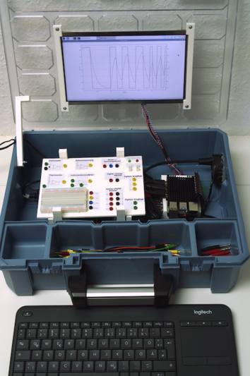  

*Abb. 2b*:  Schaltplan der im Koffer enthaltenen Komponenten  
                    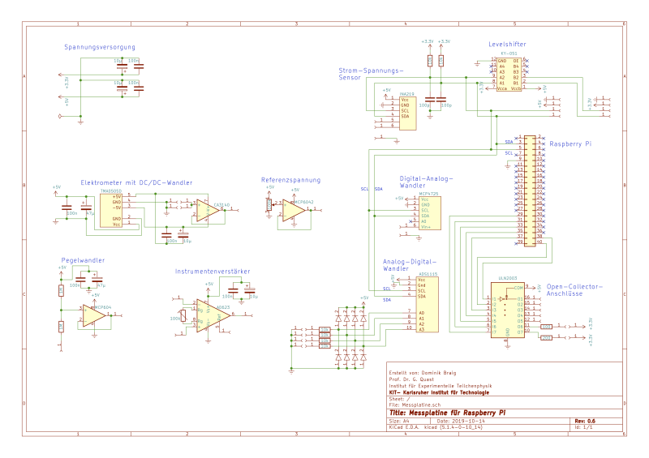  

Die Bauanleitung für den Messkoffer findet sich in den folgenden Kapiteln. 
Konkrete Anwendungen und genauere Beschreibungen der ggb. notwendigen 
Verstärkerschaltungen finden Sie in der 
[Anleitung für Lehrkräfte](https://github.com/PhyPiDAQ/EducatorsGuide/blob/main/Anleitung.md)

  

## 2. Was brauche ich und wie baue ich das zusammen ?  

Die Software ist quelloffen und kann auf dieser Github-Seite heruntergeladen  werden.  
Die ausführliche Installation wird [hier](#wiesetzeichdenraspberrypiauf)   beschrieben.

Für den Messkoffer werden die folgenden Bauteile benötigt:

### 2.1 Bestellliste

| Beschreibung  | Bestellnummer | Menge |Zulieferer|Einzelpreis in Euro|Gesamtpreis in Euro|
| ------------- |:-------------:|:-:|:--------:|-|-|
| **für die Steckplatte:** |  |  |  |  |  |
| Miniatur-Buchse, 2mm schwarz | MBI 1 SW | 9 | Reichelt | 0,79 | 7,11 |
| Miniatur-Buchse, 2mm rot | MBI 1 RT | 8 | Reichelt | 0,79 | 6,32 |
| Miniatur-Buchse, 2mm grün | MBI 1 GN | 8 | Reichelt | 0,79 | 6,32 |
| Miniatur-Buchse, 2mm gelb | MBI 1 GE | 9 | Reichelt | 0,79 | 7,11 |
| Miniatur-Buchse, 2mm blau | MBI 1 BL | 3 | Reichelt | 0,79 | 2,37 |
| Arduino - Grove Universal- Buchse, 4-Pin (10er Set) | GRV CONNEC4PIN | 1 | Reichelt | 1,25 | 1,25 |
| Standard LED Grün 5 mm | RND 135-00122 | 1 | Reichelt | 0,06 | 0,06 |
| Standard LED Rot 5 mm | RND 135-00126 | 1 | Reichelt | 0,06 | 0,06 |
| Breadboard 400 Löcher | RND 255-00005 | 1 | Reichelt | 1,90 | 1,90 |
| Buchsenleiste 2,54 mm, 1x20 | MPE 115-1-020 | 4 | Reichelt | 1,20 | 4,80 |
| Filament für 3D Drucker |  | 120g |  |  |  |
|  |  |  |  |  |  |
| **für die Platine:** |  |  |  |  |  |
| PCB Platine "PhyPiDAQ" | https://aisler.net/p/ABFAPVWM | 1 | Aisler | ca. 10 Euro| ca. 10 Euro |
| Operationsverstärker, 1-fach, DIP-8 | CA 3140 DIP | 1 | Reichelt | 0,99 | 0,99 |
| Instrumentationsverstärker, 1-fach, DIP-8 | AD 623 ANZ | 1 | Reichelt | 6,35 | 6,35 |
| Seven-Darlington-Arrays, DIP-16 | ULN 2003A | 1 | Reichelt | 0,30 | 0,30 |
| Operationsverstärker, 2-fach, DIP-8 | MCP 6042-I/P | 2 | Reichelt | 0,66 | 1,32 |
| DC-DC 5V Wandler | TMA 0505D | 1 | Reichelt | 5,50 | 5,50 |
| Analog/Digital Konverter ADS1115 | RPI ADC 4CH | 1 | Reichelt | 3,30 | 3,30 |
| Gleichrichterdiode| UF 4003 | 8 | Reichelt | 0,05 | 0,40 |
| Level Shifter | DEBO LEV SHIFTER | 1 | Reichelt | 4,15 | 4,15 |
| INA219 Strom-/ Spannungssensor | DEBO SENS POWER | 1 | Reichelt | 2,80 | 2,80 |
| Digital-Analog-Konverter | 802236543 - 62 | 1 | Conrad | 5,89 | 5,89 |
| Widerstand 10 kOhm, 1% | VI MBA 02040C1002 | 6 | Reichelt | 0,05 | 0,3 |
| Widerstand 1 kOhm, 0.1% | ARC MRA0207 1M B | 2 | Reichelt | 0,37 | 0,74 |
| Widerstand 47 Ohm, 1% | VI MBB 02070C4709 | 6 | Reichelt | 0,03 | 0,18 |
| Widerstand 100 Ohm, 1% | VI MBB 02070C1000 | 1 | Reichelt | 0,04 | 0,04 |
| Keramik-Kondensator 10 nF | KERKO 10N | 1 | Reichelt | 0,06 | 0,06 |
| Keramik-Kondensator 100 nF | KERKO 100N | 4 | Reichelt | 0,06 | 0,24 |
| Keramik-Kondensator 100 pF | KERKO 100P | 4 | Reichelt | 0,05 | 0,20 |
| Elektrolyt-Kondensator 47 μF | M-A 47U 100 | 4 | Reichelt | 0,21 | 0,84 |
| Elektrolyt-Kondensator 10 μF | KS-A 10U 16 | 4 | Reichelt | 0,11 | 0,44 |
| Punkt- Streifenrasterplatine | H25PS200 | 1 | Reichelt | 2,60 | 2,60 |
| IC Sockel 16 Pole | MPE 001-1-016-3 | 1 | Reichelt | 0,35 | 0,35 |
| IC-Sockel 14 Pole | MPE 001-1-014-3 | 1 | Reichelt | 0,29 | 0,29 |
| IC Sockeel 8 Pole | MPE 001-1-008-3 | 4 | Reichelt | 0,26 | 1,04 |
| Präzisionspotentiometer | 64Y-100K | 2 | Reichelt | 0,21 | 0,42 |
| Flachbandkabel | RPI T-COBBLER P | 1 | Reichelt | 3,60 | 3,60 |
|  |  |  |  |  |  |
| **für Gehäuse und Raspberry Pi:** |  |  |  |  |  |
| Raspberry Pi 4, 2 GB RAM | RASP PI 4 B 2GB RAM | 1 | Reichelt | 49,00 | 49,00 |
| Raspberry Pi Ladegerät | GOO 56746 | 1 | Reichelt | 8,50 | 8,50 |
| Display (optional) | RPI LCD 10.1HDMI | 1 | Reichelt | 102,10 | 102,10 |
| Netzteil Display | HNP 15-090L6 | 1 | Reichelt | 9,99 | 9,99 |
| Power supply | DEBO BREAD POWER | 1 | Reichelt | 4,50 | 4,50 |
| Speicherkarte 32GB | SDSQUAR 032GGN6MA | 1 | Reichelt | 7,95 | 7,95 |
| USB Hub | DESKHUB 60- SW | 1 | Reichelt | 6,00 | 6,00 |
| HDMI Kabel | RPI M-HDMI HDMI | 1 | Reichelt | 4,50 | 4,50 |
| Filament für 3D Drucker |  | 170 g |  |  |  |
| Tastatur mit Mauspad | LOGITECH K400PRO | 1 | Reichelt | 29,95 | 29,95 |
| USB A USB C Kabel | GOOBAY 55467 | 1 | Reichelt | 2,40 | 2,40 |
| Kühlgehäuse Raspberry Pi passiv | 2140237 - 62 | 1 | Conrad | 15,49 | 15,49 |
| Jumper Kabel | 096853 - 62 | 1 | Conrad | 2,79 | 2,79 |
| Isolierband |  | 1 Rolle |  |  |  |
| Schrauben M2.5 20 mm |  | 4 |  |  |  |
| Schrauben M3 12 mm |  | 7 |  |  |  |
| Unterlegscheiben für M3 Schrauben |  | 14 |  |  |  |
| Pfostenstecker, 40-polig, mit Verrieglung, gew. | PSL 40W | 1 | Reichelt | 0,49 | 0,49 |
| Universalkoffer | 8519544 | 1 | Hornbach | 17,95 | 17,95 |
|  |  |  |  |  |  |
| **Zubehör:** |  |  |  |  |  |
| Messleitung 15 cm rot, 2mm | 1385668-62 | 2 | Conrad | 2,49 | 4,98 |
| Messleitung 15 cm grün, 2mm | 1385671-62 | 2 | Conrad | 2,49 | 4,98 |
| Messleitung 15 cm blau, 2mm | 1385669-62 | 2 | Conrad | 2,49 | 4,98 |
| Messleitung 15 cm schwarz, 2mm | 1385667-62 | 2 | Conrad | 2,49 | 4,98 |
| Messleitung 15 cm gelb, 2mm | 1385670-62 | 2 | Conrad | 2,49 | 4,98 |
| Messleitung 30 cm rot, 2mm | 1385676-62 | 2 | Conrad | 2,49 | 4,98 |
| Messleitung 30 cm schwarz, 2mm | 1385675-62 | 2 | Conrad | 2,49 | 4,98 |
| Adapterstecker, 2 mm Stecker / 4 mm Buchse, rot | MZS2RT | 2 | Reichelt | 1,45 | 2,90 |
| Adapterstecker, 2 mm Stecker / 4 mm Buchse, schwarz | MZS2SW | 2 | Reichelt | 1,45 | 2,90 |
| Adapterstecker, 4 mm Stecker / 2 mm Buchse, rot | MZS4RT | 2 | Reichelt | 2,30 | 4,60 |
| Adapterstecker, 4 mm Stecker / 2 mm Buchse, schwarz | MZS4SW | 2 | Reichelt | 2,30 | 4,60 |
|  |  |  |  |  |  |
| **Sonstiges:** |  |  |  |  |  |
| Sekundenkleber |  |  |  |  |  |
| Schrumpfschläuche |  |  |  |  |  |
|  |  |  |  |  |  |
| **Gesamt:** |  |  |  |  |  |
| ohne Display |  |  |  |  | 284,52 |
| mit Display |  |  |  |  | 401,11 |

### 2.2 Bauanleitung

#### 2.2.1 Platine löten

Zunächst werden die Buchsenleisten (Reichelt, MPE 115-1-020) auf die passenden
Längen geknipst. Benötigt werden:
 3 x 1 Pin  
 7 x 2 Pins  
 1 x 3 Pins  
 5 x 4 Pins  
 3 x 5 Pins  
 4 x 6 Pins  
 1 x 10 Pins  
Diese werden an den entsprechenden durch Quadrate gekennzeichnete Bohrungen auf der Platine verlötet.
Die weiteren Bauteile werden entsprechend der Beschriftung auf der Platine ebenfalls verlötet. Bei den Elkos ist auf die Polarität zu achten - die weiß markierte Seite entspricht dem Minus-Pol. Widerstände und Kerkos haben keine ausgezeichnete Polarität. Die Halterungen für die ICs werden so eingelötet, dass die halbrunde Aussparung mit der Beschriftung übereinstimmt. Daran kann erkannt werden, wie herum der IC später eingesteckt werden muss.

In der Abbildung links sind zwei Plätze für Widerstände und zwei für Kondensatoren zu sehen, welche frei bleiben. Diese sind dafür vorgesehen, dass bei Störungen auf dem I²C-Bus Pull-Up Widerstände und Kondensatoren nach Masse eingebaut werden können. Zuerst sollten diese Plätze aber frei bleiben.

Zuletzt können die zu langen Füßchen auf der Rückseite abgeknipst werden. Die Bauteile werden auf die jeweilige Halterungen gesteckt. 

*Abb. 3*:  Löten, Schritt 1  
                      
*Abb. 4*:  Löten, Schritt 2: Die Buchsenleisten werden angebracht  
                      
*Abb. 5*:  Löten, Schritt 3: Die weiteren Bauteile werden angelötet. Die vier rot markierten Vorrichtungen werden freigelassen  
                      
*Abb. 6*:  Löten, Schritt 4: die fertige Platine  
                      

#### 2.2.2 Koffer bauen

Hier wird beschrieben, wie die Hardware von PhyPiDAQ mit der Vorschaltplatine, einem optionalem Display und Funktastatur in einem Standard Organizer-Koffer befestigt werden kann, sodass alles geräumig, platzsparend und sicher untergebracht werden kann. 

Als Erstes werden die 3D-Modelle im Ordner Hardware/3D_Modelle gedruckt. Je nach Drucker kann es sich anbieten, die Modelle entsprechend zu rotieren und Stützstruktur zu verwenden. Mit PLA konnten gute Ergebnisse erzielt werden.
Wenn die gedruckten Modelle vorliegen, kann mit dem Kofferbau begonnen werden.

Zunächst werden die 30cm langen Breadboard Steckverbindungen (C*, 096853-62) einmal in der Mitte durchgeschnitten, sodass 15cm lange Kabel vorliegen. Es werden insgesamt 46 kurze Kabel benötigt. Die angeschnittene Seite wird jeweils abisoliert und mit den 32 2mm-Buchsen (R*, MBI1SW und andere Farben) verlötet und abisoliert. Die Füßchen einer roten (R*, RND 135-00126) und einer grünen LED (R*, RND 135-00122) werden ebenfalls mit den Kabeln verlötet und isoliert, sowie die beiden Grove- Buchsen (R*, GRV CONNEC4PIN) und zwei Pin-Header (R*, RPI HEADER 40).
*Abb. 7*:  Kofferbau, Schritt 1: Steckverbindungen vorbereiten  
                    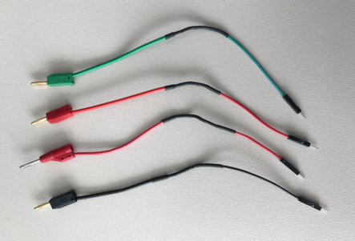  

Nun wird das gedruckte Steckbrett mit einem 5mm Holz-Bohrer an den vorgesehenen Stellen durchgebohrt. Die eckigen Ausschnitte für die Grove- Anschlüsse und die Pin-Header können beispielsweise mit einem Handstück durchgebohrt werden.

Die 2mm-Buchsen können nun entsprechend der Abbildung links eingeführt und verschraubt werden. Die LEDs, Grove-Buchsen und Pin-Header werden mit Sekundenkleber an den vorgesehenen Löchern fixiert. Das Breadboard kann mit dem rückseitig angebrachten Klebestreifen befestigt werden. Die Beschriftungen
werden ausgedruckt und an die entsprechende Stelle geklebt.

*Abb. 8*:  Kofferbau, Schritt 2: gedruckte Steckplatte mit Kabeln ausstatten  
                    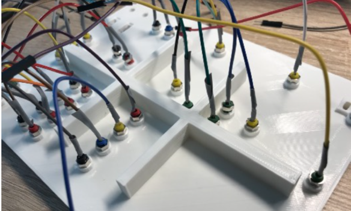  

*Abb. 9*:  Kofferbau, Schritt 3: Beschriftung an Steckplatte kleben  
                    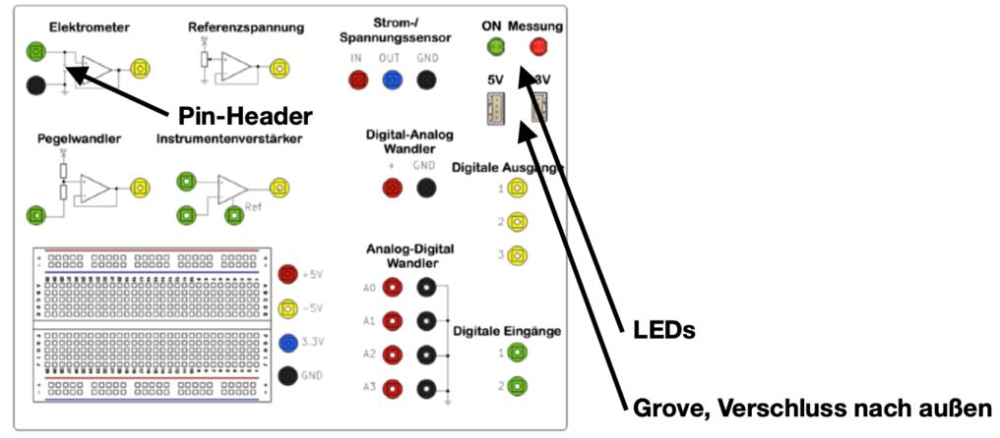  

Während der Sekundenkleber aushärtet kann der Koffer bearbeitet werden.  
Zunächst wird das Loch des gedruckten Haltestabs mit einem 3mm Bohrer durchgebohrt. Anschließend wird dieser an der linken Innenseite des Koffers so festgebohrt, dass der Deckel mit leichtem Druck von dem Stab gehalten und somit ungewolltes Zuklappen verhindert wird. Als Schraube kann eine M3x16mm und Sicherungsmutter verwendet werden.

*Abb. 10*:  Kofferbau, Schritt 4: Haltestab anschrauben  
                    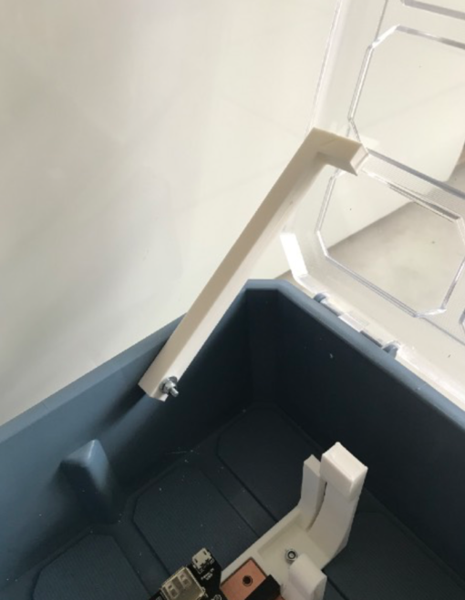  

Nun werden die Halterungen für die Platine und das Steckbrett am Boden angeschraubt. Die Platine wird hierzu eingespannt, sodass der Abstand der Halterungen zueinander korrekt ist. Der Abstand der Halterungen hinten und vorne im Koffer sollte 3,2 cm betragen und 6,5 cm nach links. Als Schrauben eignen sich M3x12mm, welche mit dem Kopf nach unten verschraubt werden, um die  Unterlage später nicht zu verkratzen.

*Abb. 11*:  Kofferbau, Schritt 5: Platine anschrauben  
                    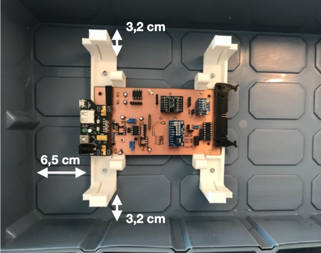

Die Bohrung für den USB-Hub (R*, DESKHUB 60- SW) wird mit einem 60 mm Bohrkranz an der rechten Seite des Koffers hinten gesetzt. Mit Heiß- oder  Sekundenkleber kann der USB-Hub nun in die Fassung geklebt werden. 

*Abb. 12*:  Kofferbau, Schritt 6: Loch für USB-Hub bohren  
                    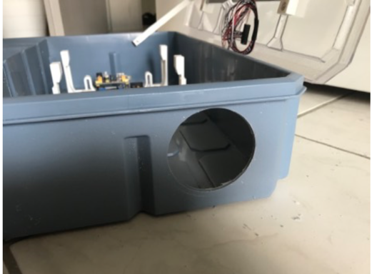

Weiter wird nun das mit dem Kabel verbundene Display im gedruckten Rahmen eingespannt und mit M3x10mm Schrauben am Deckel befestigt. Die Muttern zeigen zur Kofferinnenseite. Der Abstand des Displays nach unten beträgt maximal 5 cm, sodass die Kabel noch zum Controller reichen.  
Der Display-Controller wird mit den Kabeln versehen und die Bedieneinheit an der gedruckten Halterung mit M3x10mm Schrauben festgeschraubt. Der Controller kann nun eingeklickt werden. Die Halterung kann anschließend am Koffer entsprechend der Abbildung mit M3x12mm Schrauben befestigt werden. Der Abstand nach rechts sollte mindestens 6 cm betragen, sodass die Anschlüsse noch zugänglich sind. Bei einem Kabel ist der Platz am Controller nicht eindeutig.  Hier hilft die Farb-Codierung der Kabel: die roten Kabel stehen (meist) für  positive Spannungen. Mit der Beschriftung des Controllers kann somit der richtige Platz gefunden werden. 

*Abb. 13*:  Kofferbau, Schritt 7: Display Controller verkabeln  
                    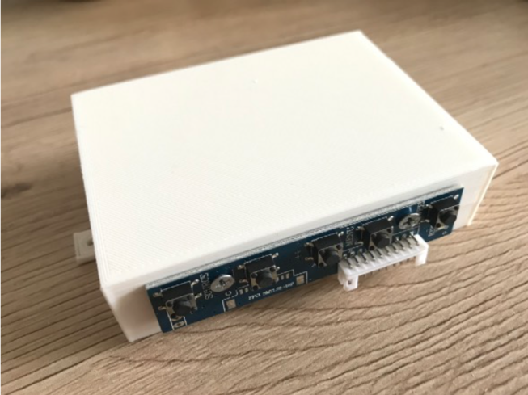  
*Abb. 14*:  Kofferbau, Schritt 8: Display Controller anschrauben  
                    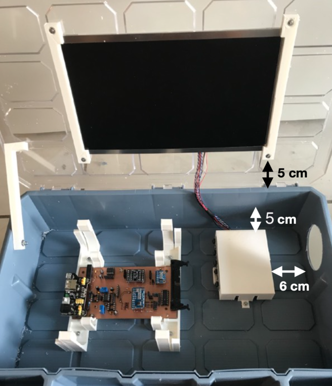  

Wenn der Sekundenkleber getrocknet ist kann die Steckplatte mit der Platine verbunden werden. Die Verbindungen sind nachfolgend dargestellt: 

*Abb. 15*:  Kofferbau, Schritt 9: Steckplatte mit Platine verkabeln  
                    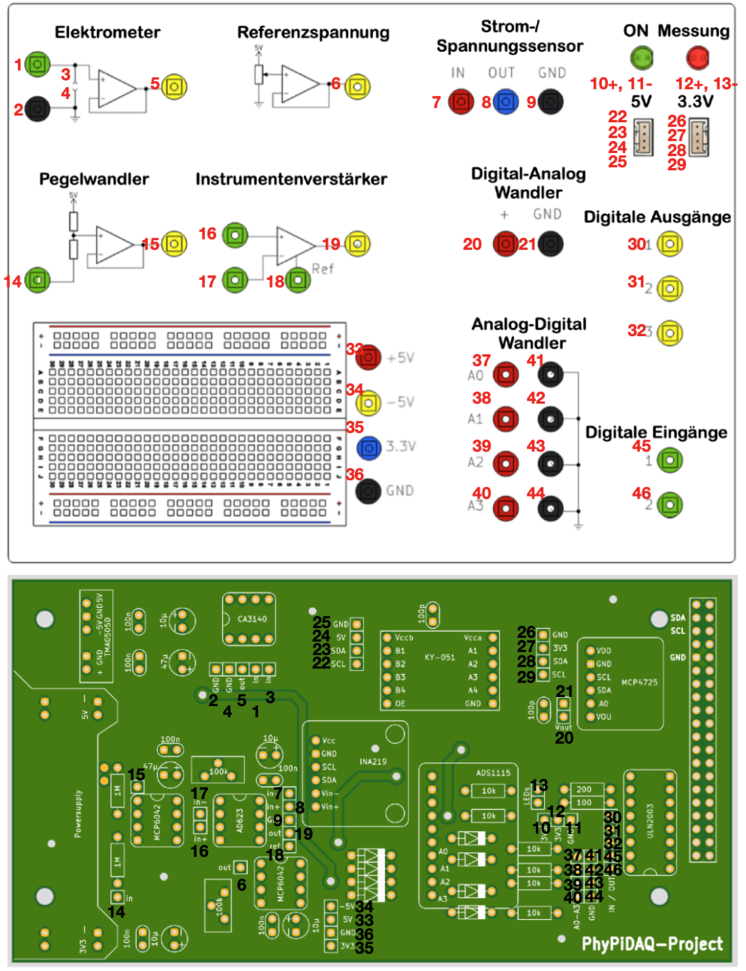  

Nun kann der Raspberry Pi montiert werden. Dazu wird zunächst der Pi auf das  Display-Controller Gehäuse an die richtigen Stelle gehalten, um die Bohrlöcher  darauf zu setzen. Anschließend wird das Kühlgehäuse (C*, 2140237 - 62) auf dem Pi befestigt. Hierzu werden die drei Wärmeleitplättchen an den entsprechenden Stellen angebracht, wobei die Folien der Ober- und Unterseite jeweils zu  entfernen sind. Mit den Schrauben M2.5x25mm wird der Kühlkörper an der  Display-Controller Halterung festgeschraubt. Die Halterung mit dem Pi kann nun  am Koffer mit M3x12mm Schrauben angebracht werden.  

*Abb. 16*:  Kofferbau, Schritt 10: Raspberry Pi Kühlkörper anbringen  
                    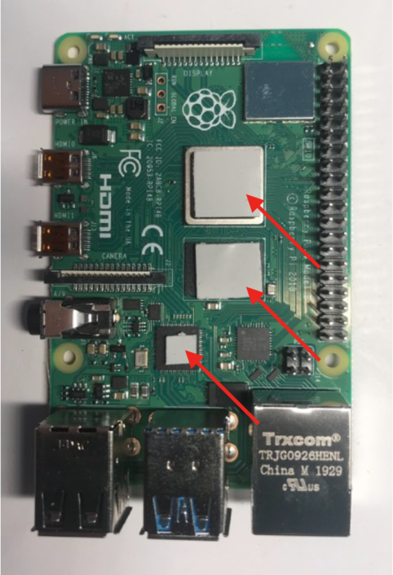  
*Abb. 17*:  Kofferbau, Schritt 10: Raspberry Pi auf Display-Controller verschrauben  
                    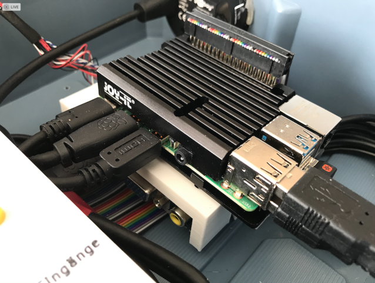  
*Abb. 18*:  Kofferbau, Schritt 10: Display-Controller Gehäuse am Koffer befestigen  
                    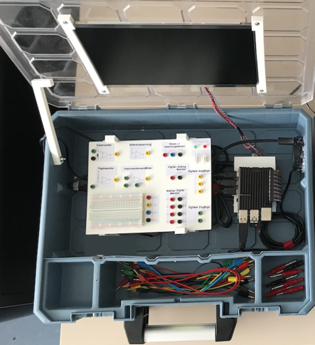  

Zuletzt wird der Raspberry Pi über die Verlängerungs-Pins (R*, RPI HEADER 40)  mit dem 40-Pin-Kabel (C*, RPI T- COBBLER P) an der Platine befestigt. Die Netzteile für Platine und Display werden ebenfalls angeschlossen. Der USB-Hub wird mit dem Raspberry Pi verbunden. Das Dongle der Funk-Tastatur  (R*, LOGITECH K400PRO) wird in den USB Port des Pi gesteckt. Der HDMI-Port des  Raspberry Pi wird mit dem entsprechenden Adapter (R*, RPI M-HDMI HDMI) mit dem Display Controller verbunden. Der HDMI Adapter (R*, DELOCK 65391) wird in den  anderen Port des Raspberry Pi eingesteckt und kann in dem USB-Hub mit Kleber  fixiert werden, sodass ein weiteres externes Display angeschlossen werden  kann. Der Power- Port des Raspberry Pi wird mit dem Adapter (R*, GOOBAY 55467)  mit der Spannungsversorgung der Platine (R*, DEBO BREAD POWER) verbunden. Die  Tastatur kann beim Zuklappen des Deckels auf der Steckplatte verstaut werden.  Die Kabel und Adapter werden in den drei Fächern einsortiert.  

*Abb. 19*:  Koffer, alle Teile mit Display und Tastatur finden in dem Koffer Platz  
                    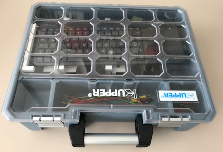  

